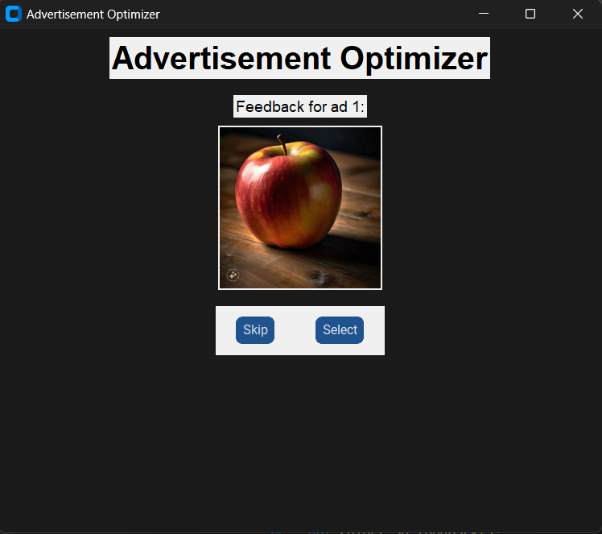

# Advertisement Optimizer

The Advertisement Optimizer is a machine learning model designed to enhance ad selection using the reinforcement learning approach with the Upper Confidence Bound (UCB) algorithm. This system efficiently balances exploration and exploitation in ad recommendations, aiming to maximize user engagement and minimize advertising costs.

## Understanding the Challenge: Multi-Armed Bandit Problem

At the heart of the Advertisement Optimizer lies the Multi-Armed Bandit Problem, a classic exploration-exploitation tradeoff in decision-making. Imagine facing multiple slot machines (bandits), each offering different rewards. Similarly, in ad selection, each ad represents an "arm" of the bandit, and the goal is to maximize total rewards (e.g., Click-Through Rate, or CTR) over time while learning which ad performs the best.

## Importance of Click-Through Rate (CTR)

CTR is a crucial metric in online advertising, representing the ratio of users who click on an ad to the total number of users who view it. Higher CTR indicates better ad performance, leading to increased user engagement and potentially higher conversion rates.

## Reinforcement Learning: Reducing Costs and Maximizing Returns

Reinforcement learning (RL) provides a framework for learning optimal decision-making strategies through interaction with an environment. In the context of ad optimization, RL algorithms enable the system to learn and adapt to user behavior in real-time, ultimately reducing costs and maximizing returns.

## Upper Confidence Bound (UCB) Algorithm

The UCB algorithm is a powerful technique for balancing exploration and exploitation in decision-making under uncertainty. It estimates the value of each option (ad) by considering both its expected reward and the uncertainty associated with that estimate. This allows the system to make informed decisions while continuously exploring potentially better options.

## Demo: GUI with Tkinter

To illustrate the Advertisement Optimizer in action, a graphical user interface (GUI) built with Tkinter is provided. This demo replicates the process of ad recommendations using images of fruits. Users select the fruit they like, providing feedback similar to clicking on an ad. The system then employs the UCB algorithm to recommend fruits based on user preferences, mimicking the ad recommendation process.

## How to Run the Demo

To run the demo, ensure you have the necessary requirements installed. Then, execute the `app.py` script to launch the GUI. Users interact with the GUI by selecting preferred fruits, and the system utilizes the UCB algorithm to recommend fruits based on user feedback.

pip install -r requirements.txt
run app.py

By leveraging the principles of reinforcement learning and the UCB algorithm, the Advertisement Optimizer provides an efficient and effective solution for optimizing ad selection and enhancing user engagement.

demo with images of fruits

